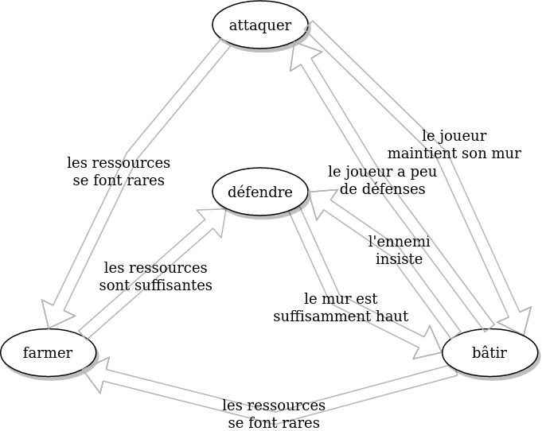

# Les bases de l'éducation d'un bot

Noth est un jeu de cartes dont les mécanismes sont inspirés d'une obscure référence vidéoludique, avec une couche graphique tirée du jeu open-source [La Bataille de Wesnoth](https://www.wesnoth.org/).

## Le champ de bataille

Le champ de bataille est découpé en deux zones identiques représentant votre camp et celui de l'adversaire.

Votre camp contient :
- Vos remparts (_bulwark_) : plus le nombre est élevé, mieux c'est ; s'il atteint 0, vous perdez la partie.
- Vos défense mobile (_defense_) : elles encaissent les dégâts en priorité ; si le nombre atteint 0, le reste des dégâts est imputé à vos remparts
- Vos ressources, qui servent à payer le coût des cartes
  - Les sentinelles (_sentinels_) : les cartes rouges servent principalement à renforcer votre défense mobile
  - Les ouvriers (_workers_) : les cartes bleues servent principalement à renforcer vos remparts et endommager les remparts ennemis
  - Les soldats (_soldiers_) : les cartes vertes infligent presque toutes des dégâts à l'adversaire
- Les générateurs (nombres entre parenthèses à côté des ressources), qui génèrent des ressources à chacun de vos tours
  - Une garnison (_garrison_) produit une sentinelle par tour
  - Une guilde (_guild_) produit un ouvrier par tour
  - Une caserne (_barracks_) produit un soldat par tour
- Votre main, composée de 6 cartes tirées aléatoirement dans votre jeu

NB : votre jeu et celui de l'adversaire sont strictement identiques et composés de 2 exemplaires de chaque carte.

## Les règles

Grâce aux cartes que vous jouez, vous devez triompher de votre adversaire sur un de ces 3 aspects :
- La suprématie militaire : si vous détruisez complètement les remparts de votre adversaire, la partie est remportée
- La prospérité : si vous construisez des remparts suffisamment hauts (le nombre est fixé par la variante utilisée), la partie est remportée
- L'opulence : si vous accumulez suffisamment d'une des 3 ressources du jeu (seuil défini par la variante, également), la partie est remportée

Votre adversaire est soumis aux mêmes règles et vous perdrez donc si vos remparts sont détruits ou si vous laissez votre adversaire construire des remparts suffisamment hauts ou accumuler suffisamment de ressources pour une suprématie.

À chaque tour, les joueurs doivent jouer une carte de leur main, ce qui en applique les effets. Certaines cartes permettent de rejouer immédiatement. Il est également possible de défausser une carte : cela compte comme une action du joueur, au même titre que de jouer une carte, mais son coût n'est pas imputé et ses effets ne sont pas appliqués.

## La variante

D'une taverne à l'autre, ce jeu n'utilise pas les mêmes conditions de départ ni les mêmes objectifs numéraires pour les victoires de prospérité et d'opulence. Ici, la variante par défaut est celle de la cité de Carcyn :
- Vous démarrez la partie avec 10 ressources et 2 générateurs de chaque type, une défense mobile de 5 et des remparts de 15.
- Les objectifs numéraires sont d'atteindre 100 exemplaires d'une ressource ou des remparts de 30.

## L'IA

NB : en phase de développement, vous pouvez ajouter une classe CSS _debug_ à la balise _body_ afin d'afficher la main de l'adversaire :wink:

Actuellement, l'IA choisit une carte aléatoirement dans sa main. S'il ne peut pas la jouer, il choisit à nouveau une carte (ça peut être la même). Au bout de 20 essais infructueux, il défausse une carte aléatoirement.

C'est le niveau zéro de l'intelligence mais c'est un bon début car le jeu est assez accessible, beaucoup de cartes sont ambivalentes donc, même en jouant aléatoirement, l'adversaire oppose une resistance intéressante. Alors imaginez ce que pourrait donner un bot éduqué, qui joue une carte avec une stratégie en tête.

## Inculquer une stratégie

Avec nos connaissances actuelles, on doit pouvoir coder une stratégie adhoc basée sur une des 3 conditions de victoire.
- La stratégie _warrior_ pourrait consister à prioriser l'attaque dans le but de gagner par suprématie militaire
- La stratégie _builder_ viserait plutôt la prospérité en priorisant la construction du rempart
- La stratégie _farmer_ accumulerait quant à elle les ressources pour atteindre l'opulence

Sauf qu'avoir un objectif, ce n'est qu'une infime partie du boulot. Il va falloir apprendre à notre bot à l'atteindre. Ici, on va se concentrer sur le développement d'une stratégie de _builder_, mais les principes sont exactement similaires pour les 2 autres approches.

## L'automate fini

Un automate est un ensemble d'états et de stimuli (pluriel de _stimulus_, si vous vous demandiez pourquoi il n'y a pas de _s_).

- Un état désigne un comportement précis du bot à un instant donné. Par exemple, en lisant cet énoncé, vous êtes certainement dans un état _blasé_ parce qu'il est sacrément long.
- Un stimulus est un événement (oui, oui) qui fait passer le bot d'un état à un autre. Par exemple, l'approche de la fin de l'énoncé est un stimulus qui vous fait passer à l'état _extatique_ parce que vous allez pouvoir coder.

Son caractère _fini_ ne vient pas du fait qu'il est déjà codé. Sinon, vous n'auriez plus rien à faire (stimulus qui vous ramènerait à l'état _blasé_). Ici, _fini_ est le contraire d'_infini_, c'est-à-dire qu'il comporte un ensemble connu et exhaustif d'états, dont il ne peut jamais sortir.

Dernière précision qui peut sembler bête mais qui est pourtant indispensable, un automate n'est valide que si :
- il existe au moins un stimulus menant à chaque état et un autre quittant chaque état
- pour _n_ états, il y a au minimum _n+1_ stimuli (sinon, c'est juste un cycle, pas un automate)

Maintenant que vous savez ce qu'est un automate fini, vous allez pouvoir ~pécho en soirée~ commencer à le coder :tada:

Voilà le diagramme correspondant à cet automate :

## Euh, ok... on fait quoi, exactement ?

On va commencer ensemble pour illustrer les grands principes. Ça se passe dans le fichier [builder.ai.js](./src/modules/ai/builder.ai.js)